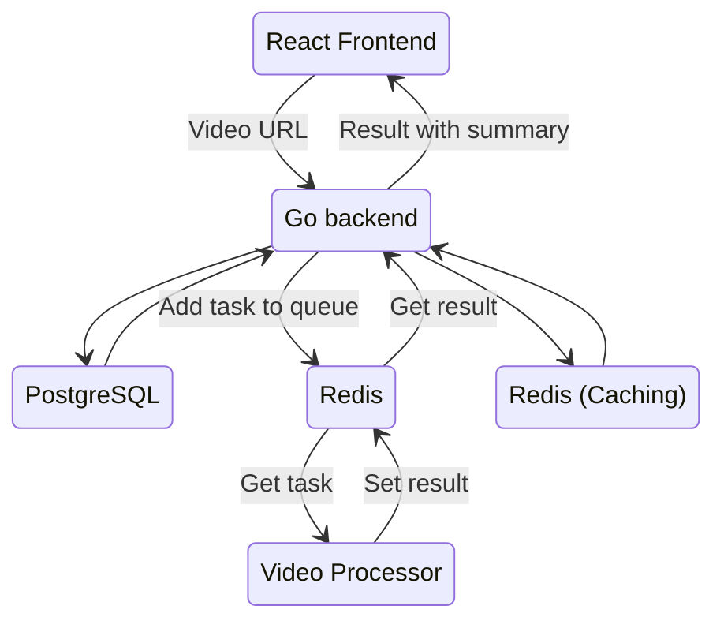
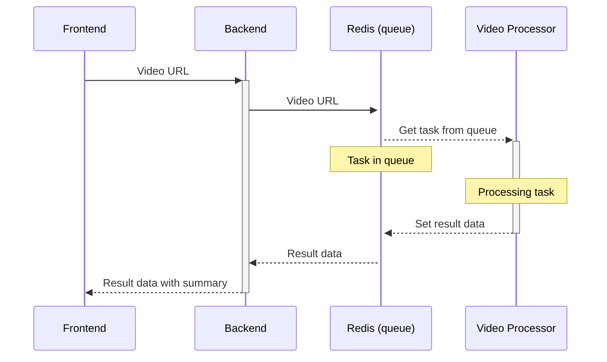
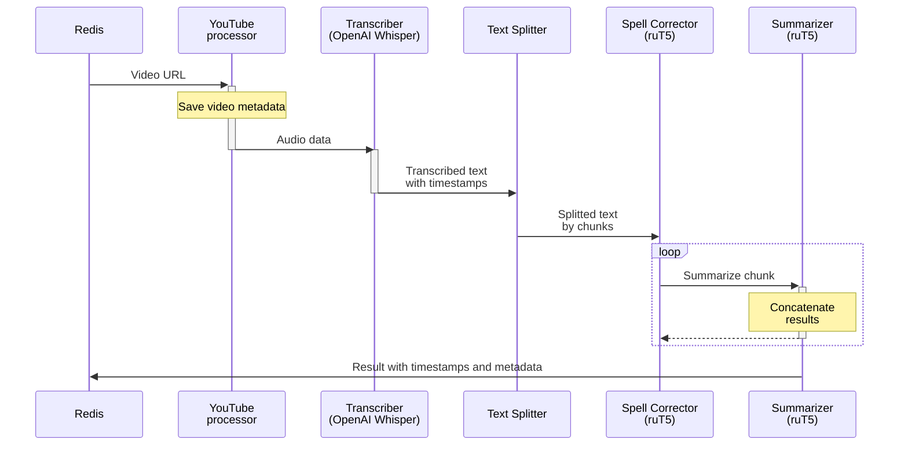

Simple project for YouTube video summarization.

---

- [Structure](#structure)
  - [General structure](#general-structure)
  - [Services interaction](#services-interaction)
  - [Video processing scheme](#video-processing-scheme)
- [Running with Docker](#running-with-docker)
  - [env](#env)
  - [Launching](#launching)

---

# Structure

The project includes two microservices and React-based frontend.

## General structure


## Services interaction



## Video processing scheme



# Running with Docker

## env

All modules include example.env files. You should create `.env` files with these examples and put them in the same directory.
Global `.env` file in the root directory must include:
```bash
REDIS_PASSWORD="<password>"

POSTGRES_USERNAME="<username>"
POSTGRES_PASSWORD="<password>"
POSTGRES_DATABASE="<database_name>"
```
**these variables must be identical in all `.env` files.**

## Launching

**Note: Docker and Docker Compose are required for launch.**
To build and launch the entire project:
```shell
docker compose up -d --build
```

Launching without building:
```shell
docker compose up -d
```

*Recommended first launch without `-d` flag to troubleshoot errors and verify configuration correctness.* 

To stop all containers:
```shell
docker compose down
```

To stop with deleting volumes with saved data:
```shell
docker compose down -v
```

*In your system the command may be `docker-compose` instead of `docker compose`*.

After launching the frontend will be available on `http://localhost:80`